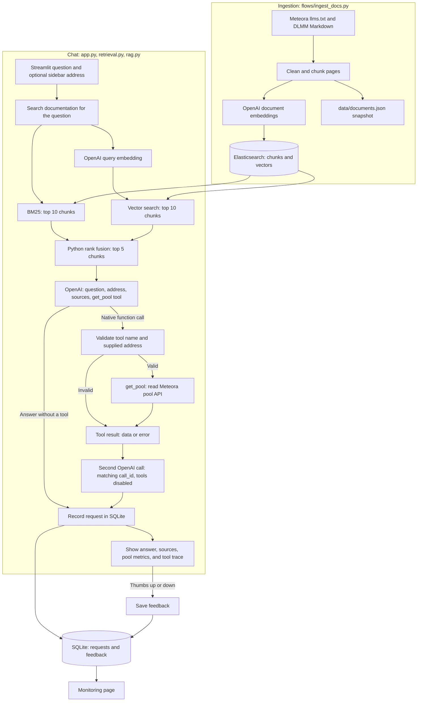
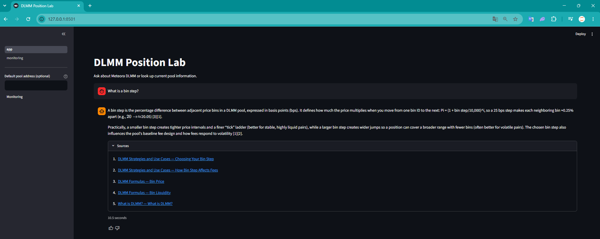
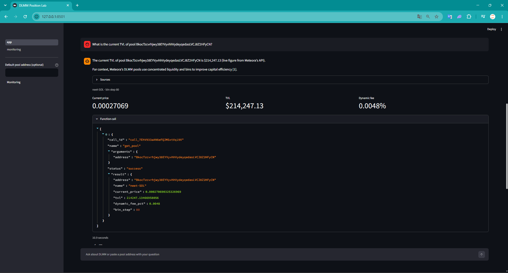
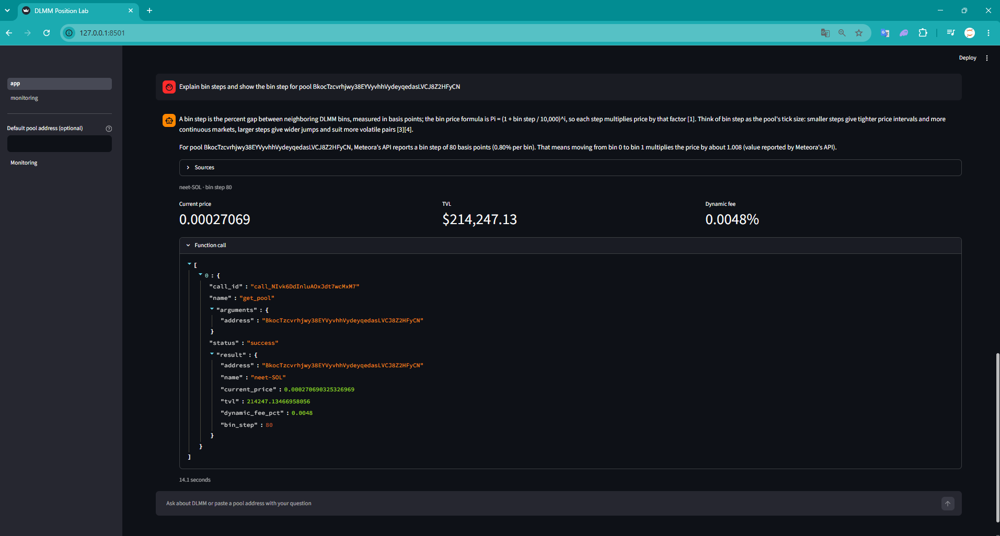
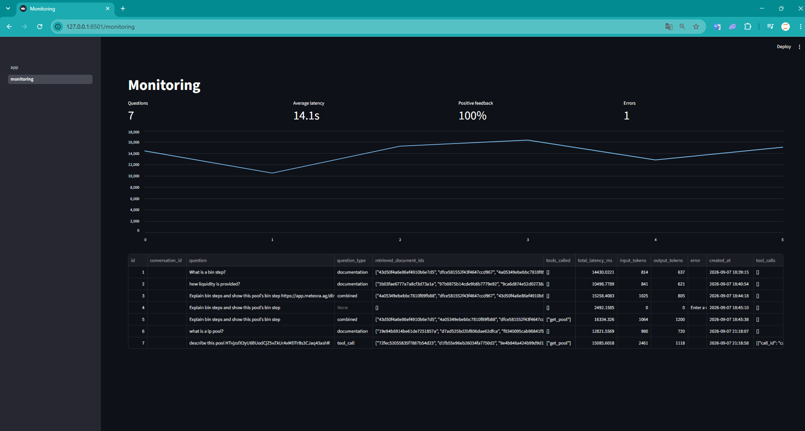

# DLMM Position Lab

An educational application for learning how Meteora DLMM pools work. Get answers grounded in official documentation and look up current pool data. Built as a course project for [LLM Zoomcamp](https://github.com/DataTalksClub/llm-zoomcamp).

Built with Python, Streamlit, Elasticsearch, OpenAI, and SQLite. Pool access is read-only; the app gives educational explanations, not investment recommendations.

## System Architecture & Workflow



Ingestion splits pages by heading into roughly 900-character chunks with 20 words of overlap. It embeds the chunks, rebuilds the Elasticsearch index, and saves a local JSON snapshot. Chat searches Elasticsearch; it does not read the snapshot.

Every question first retrieves documentation, including questions about live pools. Python combines the top 10 keyword and vector results using Reciprocal Rank Fusion and sends up to five chunks to the model. A documentation answer uses one LLM call. If the model requests `get_pool(address="…")`, Python validates the request, looks up the pool, and sends the data or error back as `function_call_output` with the matching call ID. A second LLM call writes the answer with further tool calls disabled.

The app logs requests, latency, LLM token counts, and tool traces in SQLite before displaying successful responses. Request exceptions are logged and shown as errors. Feedback is saved separately; the Monitoring page reads both tables. Evaluation runs separately from chat, as described below.

## Run with Docker

Requirements: Docker Compose and an OpenAI API key. Run these commands from the repository root.

```bash
cp .env.example .env
```

Set `OPENAI_API_KEY` in `.env`, then:

```bash
docker compose build app
docker compose up -d --wait elasticsearch
docker compose run --rm app python flows/ingest_docs.py
docker compose up -d app
```

Open [localhost:8501](http://localhost:8501). In Codespaces, open port **8501** from the Ports tab.

Ingestion and chat call OpenAI and incur API costs. Rerunning ingestion rebuilds the documentation index. Rebuild it after changing the embedding model or dimensions.

Stop the app with `docker compose down`. The Elasticsearch volume and local SQLite database persist.

## Run Python locally

Requires Python 3.12+ and `uv`. Create `.env` as above, using `ELASTICSEARCH_URL=http://localhost:9200`.

```bash
uv sync --locked
docker compose up -d --wait elasticsearch
uv run python flows/ingest_docs.py
uv run streamlit run src/dlmm_position_lab/app.py
```

## Demo

### Documentation chat

Ask **“What is a bin step?”** to get an explanation with numbered citations. Expand **Sources** to open the supporting documentation.



### Live pool information

Ask **“What is the current TVL of pool YOUR_POOL_ADDRESS?”**, replacing `YOUR_POOL_ADDRESS` with a Meteora DLMM pool address. The response includes pool metrics. The expanded **Function call** panel shows the model's `get_pool` request, address argument, and API result.



The model selects the tool and its address argument. An address in the message takes priority over the optional sidebar default. If no address is supplied, the assistant asks for one. See [rag.py](src/dlmm_position_lab/rag.py) for the tool schema and execution flow.

### Documentation and pool data together

Ask **“Explain bin steps and show the bin step for pool YOUR_POOL_ADDRESS.”** The answer combines a cited explanation with the pool's bin step from Meteora's API.



### Monitoring and tool execution

Rate an answer, then open **Monitoring** to see request counts, latency, feedback, and errors. In the request table, `tools_called` lists `get_pool`; `tool_calls` records its call ID, arguments, result, and success or error status.



Chat history is displayed for the session; each question is answered independently. Repeat the address in a later question or set the optional sidebar default.

## Evaluation

The datasets contain 30 retrieval questions, 5 RAG questions, and 12 tool-selection questions. Compare BM25, vector, and hybrid retrieval with Hit Rate@5 and MRR:

```bash
docker compose run --rm app python evaluation/evaluate.py
```

Include generated-answer and native function-call checks:

```bash
docker compose run --rm app python evaluation/evaluate.py --quality
```

For local Python, use `uv run python evaluation/evaluate.py --quality`.

Results are written to `evaluation/results.json`. RAG checks cover a nonempty answer, sources, valid citation numbers, and an expected document in retrieval. They do not measure factual correctness; inspect the saved answers too. Labels refer to chunk IDs, so review them when source documentation changes.

Tool checks verify whether the model requests `get_pool` and supplies the expected address, including missing addresses and sidebar overrides. Their addresses are synthetic; these selection checks do not execute Meteora API requests. See [saved results](evaluation/results.json). These are small evaluation sets, and model output can vary between runs.

Saved evaluation: hybrid Hit Rate@5 **1.00**, MRR **0.783**, RAG checks **5/5**, native tool-selection checks **12/12**.

## Files

```text
flows/ingest_docs.py                   Download, chunk, embed, and index
src/dlmm_position_lab/
    app.py                            Documentation chat and pool lookup UI
    retrieval.py                      Embeddings, BM25, vector search, RRF
    rag.py                            Native get_pool tool and grounded answers
    storage.py                        SQLite requests and feedback
    pages/monitoring.py               Usage dashboard
evaluation/
    evaluate.py                       Retrieval, RAG, and tool-call evaluation
    *_questions.json / questions.json Reviewed questions
data/                                 Generated chunks and SQLite database
docs/images/                          Demo screenshots
```
